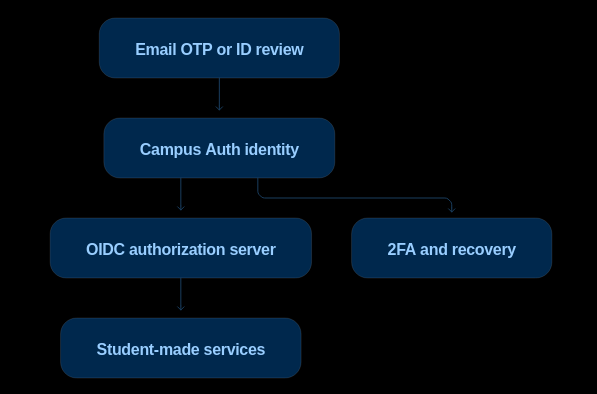

<p align="center">
  
</p>

<h1 align="center">Quad</h1>

<p align="center">
  Campus identity, verified once.<br/>
  An open-source OIDC provider for student-built apps.
</p>

<p align="center">
  <a href="#quickstart">Quickstart</a> · <a href="#how-it-works">How it works</a> · <a href="#self-hosting">Self-hosting</a> · <a href="#contributing">Contributing</a>
</p>

---

## Why this exists

This exists because there is no much of an option.

I was creating formsetta but the core problem was identity proofing. Even after this it's going to have a lot of weak links
due to just how university manages these things, but anyways a better layer to solve the identity layer across college campuses.

The point was proving identity somehow for formsetta, but then taking it out from that and creating a proper system that can be used in any services that students create in further future(what insane hope, lol)

The workflow goes something like -

College-email OTP → instant email_verified.
Email + enrollment-number consistency → student_verified.
No working college email → manual ID-card review.

Get registered on this once and go ahead and use various tools without having to prove identity again and again.



## How it works

1. **Students create an account** with their college email, name, university, and enrollment number.
2. **Verify identity** via college email OTP (instant) or ID card upload (manual review by a trusted reviewer).
3. **Apps integrate "Sign in with Quad"** using standard OpenID Connect. They redirect users, Quad authenticates and returns verified claims.

Apps receive signed tokens with claims like:

```json
{
  "sub": "random-stable-id",
  "name": "Student Name",
  "institution": "GGSIPU",
  "student_verified": true
}
```

Enrollment number requires an explicit privileged scope. Most apps only need `student_verified: true`.

## Tech stack

- **Keycloak 26.2** as the backend identity store (never exposed to end users)
- **Next.js 16** App Router for UI and OIDC endpoints
- **PostgreSQL** for OAuth clients, consent grants, and signing key persistence
- **Caddy** for auto-HTTPS reverse proxy
- **Docker Compose** for deployment

## Quickstart

```bash
# Prerequisites: Node.js 22+, pnpm 9+, Docker

# Install dependencies
pnpm install

# Start Keycloak and Postgres
cd docker && docker compose up -d && cd ..

# Set up env
cp apps/web/.env.example apps/web/.env.local
# Edit .env.local with your values

# Start dev server
pnpm --filter web dev
```

After Keycloak is up, create a `quad` realm and `quad-web` client, then hit `POST http://localhost:3000/api/setup` to configure user profile attributes.

## OIDC endpoints

| Endpoint | Method | Description |
|----------|--------|-------------|
| `/.well-known/openid-configuration` | GET | Discovery document |
| `/oauth/authorize` | GET | Start authorization flow |
| `/oauth/token` | POST | Exchange code for tokens |
| `/oauth/userinfo` | GET | Get user claims (Bearer token) |
| `/oauth/jwks` | GET | JWK Set for token verification |

Supports Authorization Code Flow with PKCE (S256 and plain).

## Scopes

| Scope | Claims | Notes |
|-------|--------|-------|
| `openid` | `sub`, `email`, `name` | Required |
| `profile` | `institution`, `student_verified` | University and verification status |
| `campus` | `institution`, `student_verified` | Alias for profile |
| `enrollment` | `enrollment_number` | Privileged. Student ID number |

## Self-hosting

```bash
cd docker
cp .env.example .env
# Edit .env with your domain, passwords, SMTP config

docker compose -f docker-compose.prod.yml up -d
```

Caddy handles HTTPS automatically via Let's Encrypt. You need two DNS A records pointing to your server (one for Quad, one for Keycloak).

After containers are up:
1. Create a `quad` realm in Keycloak
2. Create a `quad-web` client with direct access grants
3. `curl -X POST https://yourdomain.com/api/setup`

## Open questions about hosting

These are real decisions that need to be made for any campus deploying Quad:

- **Who hosts the instance?** The student engineering club? The college IT department? A student org like an open-source community? Whoever hosts it effectively controls the trust root.
- **Where does the data live?** University policy may require student data to stay on-campus infrastructure. Cloud hosting (even free tiers) may not be acceptable.
- **SMTP for OTP emails.** Free options like Gmail app passwords have daily limits (500/day). A campus deployment at scale needs a proper mail relay or the university's SMTP server.
- **Domain and TLS.** Ideally under a subdomain the college controls (e.g. `quad.college.edu`) so users can trust it. Getting a subdomain from college IT is a bureaucratic exercise.
- **Backup and recovery.** Postgres data, Keycloak realm config, and signing keys all need backups. Losing the signing keys invalidates every token ever issued.
- **Reviewer trust model.** Who gets reviewer access to approve ID cards? How are reviewers themselves vetted? This is the weakest link in the whole system.
- **Sustainability.** Student projects die when the maintainers graduate. The deployment, domain, and reviewer pipeline need to survive turnover.

If you're deploying Quad at your campus and have figured out answers to any of these, please open a discussion or PR. Real-world deployment notes are extremely valuable.

## Design and security philosophy

The college email containing the enrollment number is fine. The security doesn't come from the address being unpredictable; it comes from proving control of the university-managed mailbox. Manual ID review covers students without access.

### Identity model

Quad stores:

- Random permanent user ID (`sub`). Never uses enrollment number as the primary key.
- Enrollment number, college, course and batch.
- Verification method: `college_email` or `manual_id`.
- Verification state and expiry.

### Security boundaries

- Trust chain: Keycloak → verification service → client apps
- Reviewer → admin panel, student → OTP
- PKCE for all OAuth flows
- Rate limiting on login, OTP, and registration
- Secure HTTP-only same-site cookies
- No college portal passwords are ever collected or proxied
- ID card images accessible only to authorized reviewers

### What's not implemented yet

- Passkeys/WebAuthn
- TOTP 2FA for reviewers
- Verification expiry and re-verification
- Audit logging
- Account recovery beyond email
- SDK examples for common frameworks

## Contributing

See [CONTRIBUTING.md](CONTRIBUTING.md) for setup instructions and guidelines.

## License

MIT
